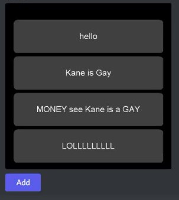

<div align="center">
    
</div>

# DUI - Discord UI   
High-performance Discord Message Component Based Kotlin UI Framework
<br>
Render Interactive Message and Manage States and Listeners

## Installation
```xml
<dependency>
    <groupId>io.github.sonmoosans</groupId>
    <artifactId>dui</artifactId>
    <version>1.3.2</version>
</dependency>
```

## Features
DUI provides high code quality, high performance, memory safe UI System

## Clean, Beautiful code
```kotlin
val counter = component<Unit> {
    val count by useState("count", 0)

    embed(title = "Counter", description = count.toString())

    row {
        button("Increase") {
            count++
            event.edit()
        }
    }
}
```

## Useful Hooks
ID of Built-in Hooks can also be anonymous, which is generated from lambda
```kotlin
val theme = useContext(ThemeContext)
val state by useState("id", "initial value")
val (count, setCount) = useState { "initial value" }
val sync = useSync()
val memo = useMemo(dependencies) { processString(state) }
val confirmModal = useModal {
    title = "Do you sure?"

    row {
        input(id = "confirm", label = "Type 'I am gay' to confirm")
    }

    submit {
        //do something
    }
}

useChange(dependencies) {
    println("Updated!")
}
useEffect(dependencies) {
    println("Updated!")
}
useExport(data = "Export Something")
```

## Built-in Components
DUI also provides some built-in Components

```kotlin
rowLayout { //Split into multi Action Rows if overflow
    button(label = "Test") {
        event.ignore()
    }

    menu {
        option("Label", "Value")

        submit {
            event.ignore()
        }
    }
}
pager { //a simple Pager implementation
    page {
        embed(title = "Page 1")
    }
}
tabLayout { //Adds a SelectMenu to switch between Tabs
    tab("User") {
        text("Your Profile")
        proflie()
    }

    tab("Settings") {
        embed(title = "Settings Tab")
    }
}
```

## Memory Safe
Component only needs a `Data` instance for rendering, All those Data will be stored in a Map
<br>
You can implement your own listener management system above it

Remember that You **must** destroy unused Data manually

## Component Listeners
### Data Based Listeners
```kotlin
val result = something()
button("Do something") {
    println(result)
    event.edit()
}
```
Data Based Listeners are stored in each `Data` object
<br>
Therefore, It will use some memory when creating a lot of data objects

### Dynamic Listener
```kotlin
val ref = useRef { something() }
button("Do Something", dynamic = true) {
    println(ref.current)
    event.edit()
}
```
You may use Dynamic Listener instead to reduce memory usage of listeners

Since they are bundled with Component itself
<br>
Dynamic Listeners only needs to be created once, and can be used for unlimited times.

Since data is not synchronized, You cannot access any data outside the Listener
<br>
**You must wrap those variables inside a `useRef` hook to access them** 

### Note
Data based Listeners can override dynamic listeners by using the same ID
### ID Structure
Listener ID Structure: `[Component ID]-[Data ID]-[Listener ID]`

```kotlin
row {
    button("Do Something") { //ID: 4343243243-3-432423432
        println("Component Interaction Event")
    }

    button("Remove", id = "onRemove") { //ID: 4343243243-3-onRemove
        println("Component Interaction Event")
    }
    
    menu(placeholder = "Select Item") {
        option("...", "...")
        
        submit("onSelect") { //ID: 4343243243-3-onSelect
        }
    }
}
```
To use external Listener ID, don't pass the event handler
<br>
Therefore, you can create your own Event handler
<br>
```kotlin
row {
    //For Select Menu, just pass the ID to root function instead of 'submit' function
    menu(id = "onRemove", placeholder = "Select Something") {
        option("...", "...")
    }
    button("Remove", id = "onRemove") //ID: onRemove
}
```

### Highly Flexible


Not only embed or text, DUI supports render everything. Including rendering UI with Graphics2D
<br>
DUI also has a small Utility for Rendering with Graphics2D

```kotlin
//You may wrap this in useMemo Hook
val image = BufferedImage(500, 600, BufferedImage.TYPE_INT_RGB)

with (image.createGraphics()) {
    val (w, h) = 450 to 100

    font = font.deriveFont(25f)
    translate((500 - w) / 2, 50)

    for (i in 0..3) {
        paint(Color.DARK_GRAY) {
            fillRoundRect(0, 0, w, h, 20, 20)
        }

        translate(0, h + 10)
    }
}

files {
    file("ui.png", image.toInputStream())
}
```

## Getting Started
Create a Component
```kotlin
val example = component {
    val count by useState("count", 0)

    text(count.toString())

    row {
        button("Increase") {
            count++
            event.edit()
        }
    }
}
```
In above example, we create a `count` state
<br>
When "Increase" Button is clicked, Increase count state and Reply to the event

Then, Register a Slash command (We use [BJDA](https://github.com/SonMooSans/B-JDA) for this)
<br>
See their tutorial to learn how to use BJDA
```kotlin
fun TestCommand() = command("test", "Testing Command") {

    execute {
        val ui = example.create(event.user.idLong, Unit) {
            //sync(event.hook)
            //use with useSync hook to sync multi messages
        }

        event.reply(ui).queue()
    }
}
```

## Known issues
* Dynamic Listeners unmounted after restarting bot

## Support My Job
Give this repo a star!
